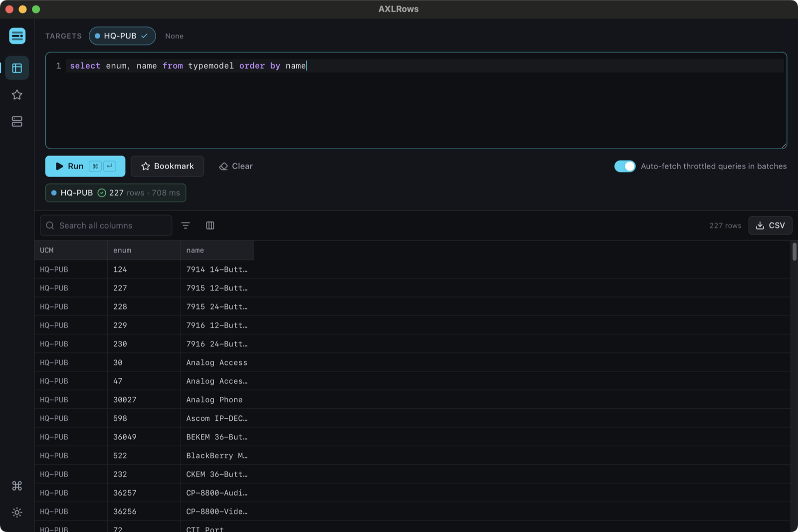
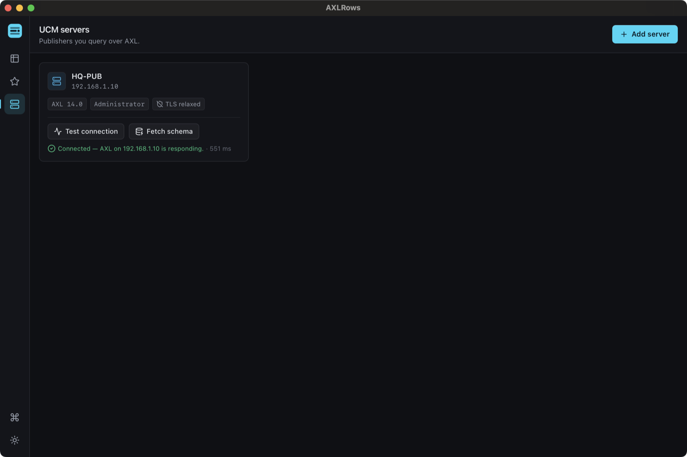
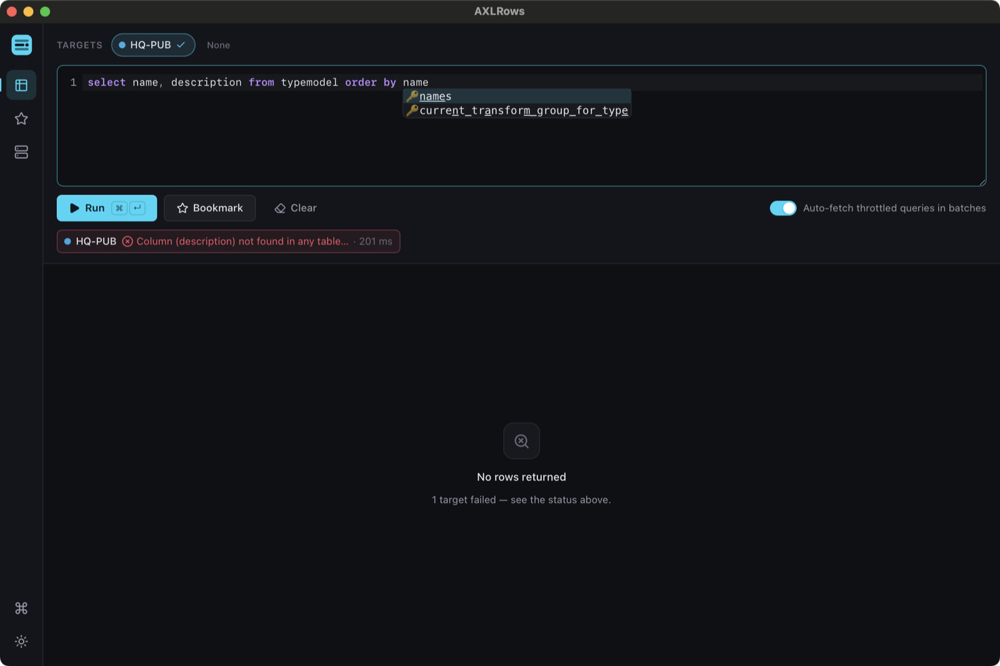
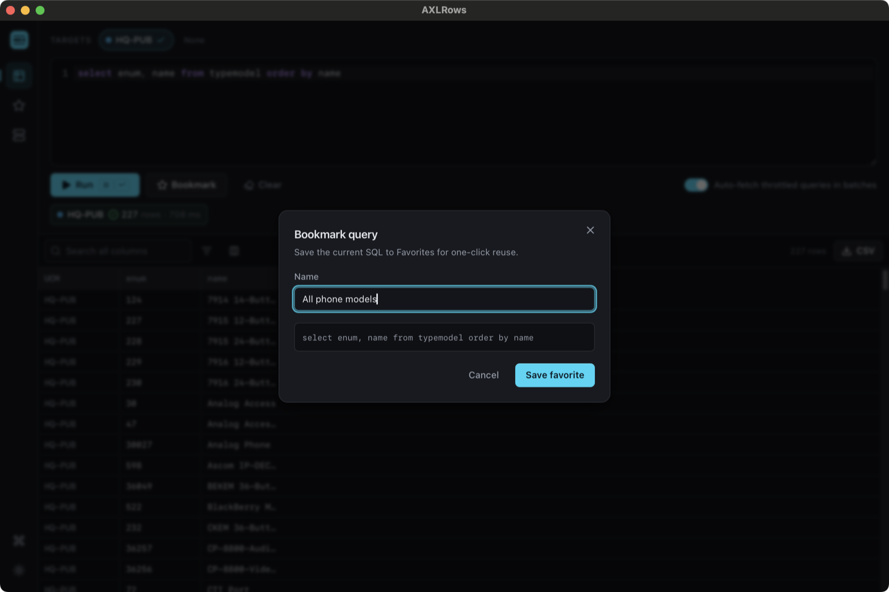
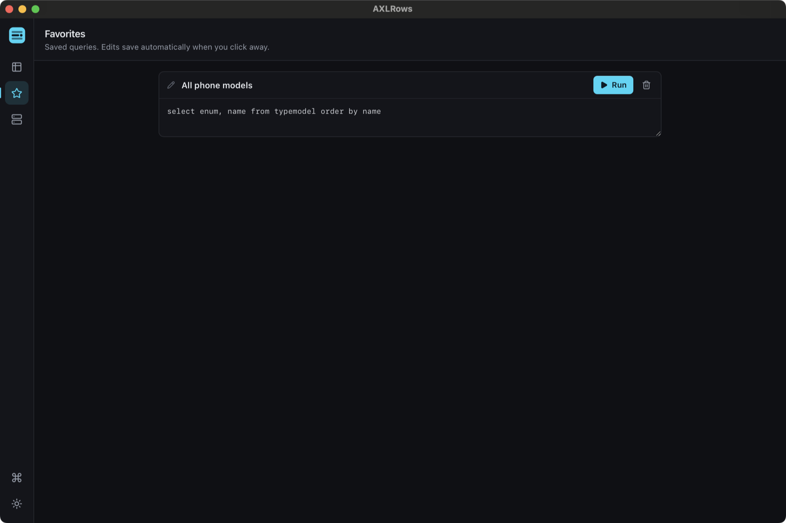
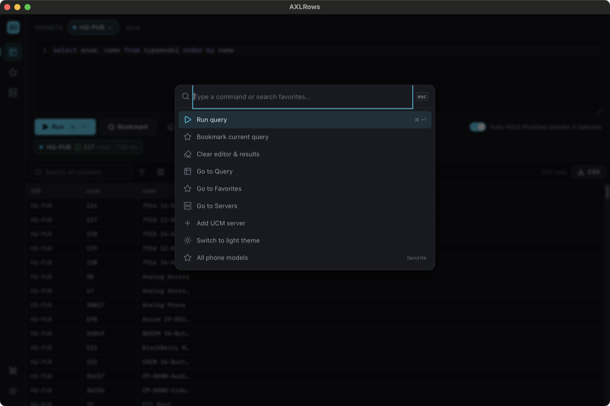
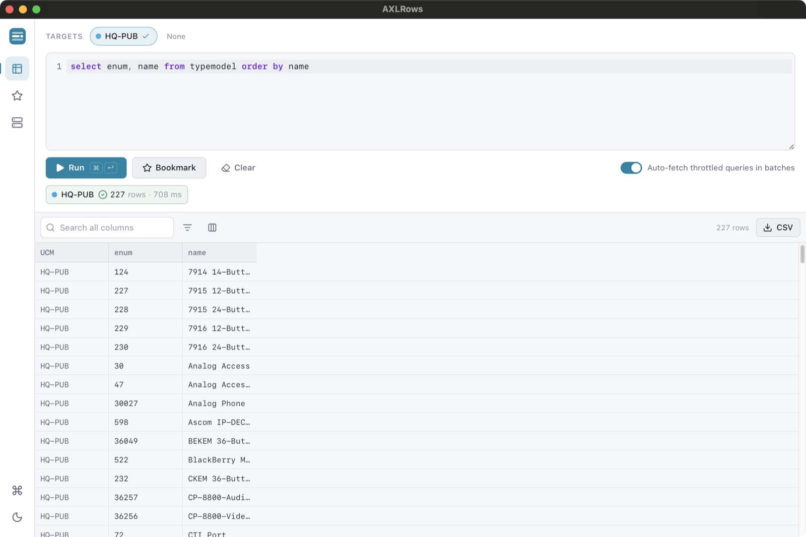

# AXLRows User Guide

*The Cisco UCM SQL client you've always wanted.*

AXLRows sends SQL to one or more Cisco Unified CM publishers over the AXL
`executeSQLQuery` API and merges every row into a single sortable,
filterable, exportable grid.

## Install

**Windows:** download the `.msi` or `-setup.exe` installer from the
[latest release](https://github.com/Karmatek-Consulting-LLC/axlrows/releases/latest)
and run it.

**macOS / Linux:** build from source for now — see the
[README](https://github.com/Karmatek-Consulting-LLC/axlrows#build-from-source).

## Add your first UCM server

Open the **Servers** view (the server icon in the sidebar, or `Ctrl/Cmd+3`)
and click **Add server**. You'll need:

- the publisher's address,
- an account with the **Standard AXL API Access** role (in a lab, the
  Application Administrator account works),
- the UCM version, which selects the AXL schema namespace.

Click **Test connection** to confirm AXLRows can authenticate — a passing
test shows the AXL version and round-trip latency:

Two things worth knowing:

- **Your password never touches disk.** It's stored in the OS keychain
  (Windows Credential Manager / macOS Keychain / libsecret); the local
  database holds only non-secret metadata.
- **Verify TLS certificate is off by default**, matching lab UCMs with
  self-signed certs. It's per-server — turn it on for production
  publishers.

## Run your first query

Back in the **Query** view (`Ctrl/Cmd+1`):

1. **Pick your targets.** Click the server chips in the TARGETS row to
   select which publishers receive the query. The Run button stays
   disabled until at least one target is selected.
2. **Write SQL** in the editor, with syntax highlighting and SQL keyword
   autocompletion.
3. **Run** with the button or `Ctrl/Cmd+Enter`.

Each target reports its own status chip — row count and latency on
success. Rows from every publisher merge into one grid, each row tagged
with the UCM it came from.

## Working with results

- **Sort** by clicking a column header.
- **Filter** per column, or use the *Search all columns* box.
- **Hide columns** with the column-visibility control.
- **Export CSV** with the CSV button — a native save dialog opens.

## When a query fails

One server failing doesn't kill the run: every target reports
independently, and errors surface in that target's status chip with the
actual Informix message from UCM:

## Favorites

Save a query you'll run again: click **Bookmark**, give it a name, and
it lands in the **Favorites** view (`Ctrl/Cmd+2`).

From Favorites you can run a saved query with one click, edit the name
or SQL in place (edits save when you click away), or delete it:

## Command palette

`Ctrl/Cmd+K` opens the command palette from anywhere — run or bookmark
the current query, jump between views, add a server, switch themes, or
launch any saved favorite by name:

## Large result sets

UCM caps `executeSQLQuery` responses at 8 MB and rejects bigger results
with a fault. AXLRows parses that fault and offers a one-click batched
fetch — it re-runs the query with Informix `SKIP`/`FIRST` paging and
merges the batches back into the grid. Batch size is deliberately
conservative (the UCM-suggested fetch size divided by 5, halving again
if a batch still throttles), the fetch is cancellable, and progress is
reported per batch.

The **Auto-fetch throttled queries in batches** switch starts the
batched fetch immediately instead of asking first. It's off by default
so a query matching millions of rows can't quietly hammer a production
publisher.

Queries that can't be paginated safely (a top-level
`UNION`/`INTERSECT`/`MINUS`, or existing `SKIP`/`FIRST`/`LIMIT`) are
left alone — AXLRows tells you why instead of mangling your SQL.

## Keyboard shortcuts

| Shortcut | Action |
|---|---|
| `Ctrl/Cmd+Enter` | Run the query |
| `Ctrl/Cmd+K` | Open the command palette |
| `Ctrl/Cmd+1` | Query view |
| `Ctrl/Cmd+2` | Favorites view |
| `Ctrl/Cmd+3` | Servers view |

## Themes

Light and dark, persisted across restarts. Toggle with the sun/moon
button at the bottom of the sidebar, or from the command palette.

---

*Found a bug or want a feature?
[Open an issue](https://github.com/Karmatek-Consulting-LLC/axlrows/issues).*
